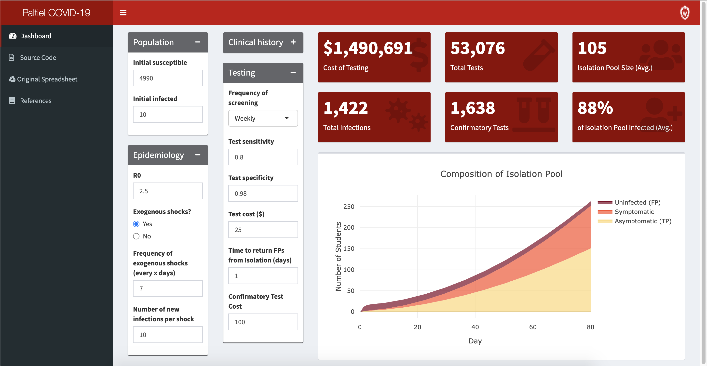

# Dashboard for COVID-19 Screening

A dashboard to visualize and evaluate the results of "Assessment of SARS-CoV-2 Screening Strategies to Permit the Safe Reopening of College Campuses in the United States" by A. David Paltiel, Amy Zheng, and Rochelle P. Walensky.  It's build in R with `shiny` and `shinydashboard`.  Check it out at https://data-viz.it.wisc.edu/covid-19-screening/.

## Brief disclaimer

This dashboard is **not** implemented by the original authors of the paper, and we cannot guarantee that the methodology is implemented exactly as the paper.  We have made extensive checks against a [spreadsheet](https://docs.google.com/spreadsheets/d/1otD4h-DpmAmh4dUAM4favTjbsly3t5z-OXOtFSbF1lY) mentioned in the original paper, which now links directly to our dashbaord. 

## Contact

We encourage suggestions of new features and improvements to make the visualizations more helpful. The developers can be contacted below.

- Srikanth Aravamuthan ( aravamuthan@wisc.edu )
- Sean Kent ( spkent@wisc.edu )
- Steve Goldstein ( sgoldstein@wisc.edu )
- Brian Yandell ( brian.yandell@wisc.edu )